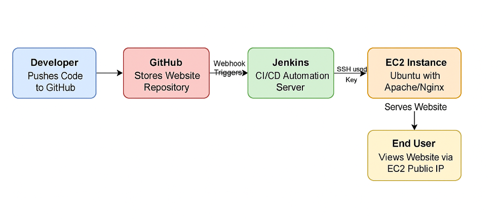
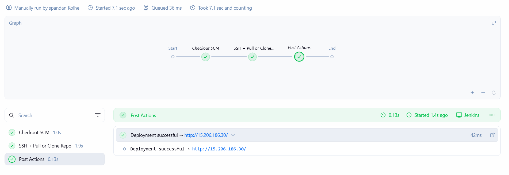
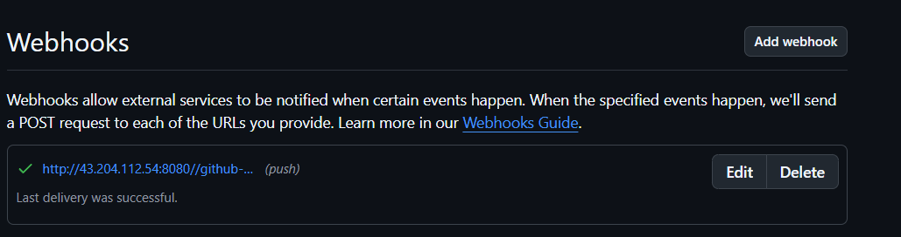
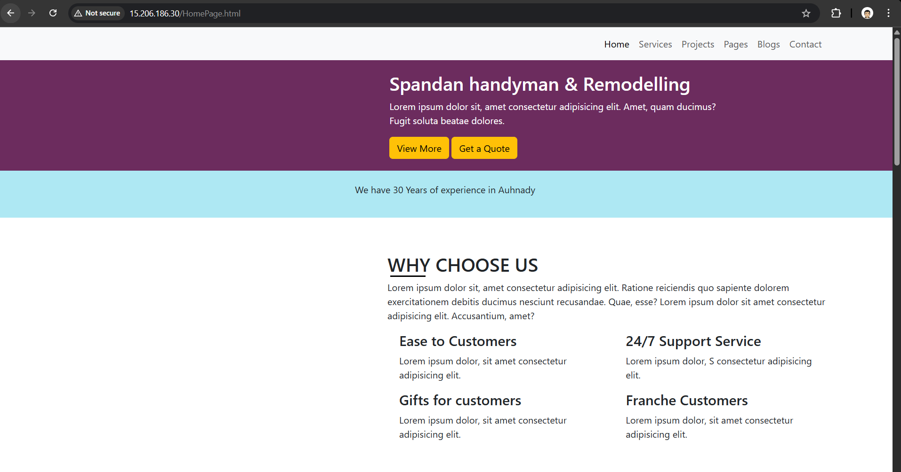

# Static Website Deployment on AWS EC2 using Terraform and Jenkins Automation

## Overview

This project demonstrates how to deploy a static website on an EC2 instance using Terraform and automate updates using a Jenkins CI/CD pipeline. The website files are hosted on an Apache or Nginx web server running on the EC2 instance. Any update pushed to GitHub automatically triggers Jenkins, which connects to the EC2 server, pulls the latest code, and updates the website.

This project covers key DevOps tools: Terraform, Jenkins, GitHub, and AWS EC2.

## Architecture 

- Static website code is stored in a GitHub repository.

- Terraform is used to provision AWS infrastructure:

- EC2 instance

- Security Group allowing HTTP access on port 80

- User Data script to install Apache or Nginx and clone the initial website code

- Jenkins is configured with:

- GitHub Webhook to trigger automatically when new code is pushed

- SSH credentials to connect to the EC2 server

- A pipeline that pulls the latest code into /var/www/html and restarts Apache or Nginx

- Updated website becomes visible immediately on the EC2 public IP.

## Steps Performed
### 1. Forking and Editing the Project

- The static website template was forked from:
https://github.com/sruthi234/static-website-project

- UI changes were made to HTML and CSS files and pushed to a personal GitHub repository.

### 2. Terraform Infrastructure Setup

- EC2 Instance :
An Ubuntu EC2 server was provisioned to host the static website.

- Security Group :
Allowed inbound HTTP traffic on port 80 so users can access the website.

- User Data Script : 
Automatically runs at instance boot time to:

- Install Apache 

- Install Git

- Clone the GitHub repository into /var/www/html

- Set correct permissions so the web server can serve the files

- Outputs
Terraform outputs : the EC2 public IP address after deployment.

### 3. Jenkins CI/CD Pipeline Setup
- Jenkins Pipeline performs the following:

- Triggered automatically from a GitHub webhook on every push.

- Pulls the Jenkinsfile from the GitHub repository.

- Connects to the EC2 instance using SSH credentials stored in Jenkins.

- Navigates to /var/www/html.

- Pulls the latest code using a Git pull or fresh clone.

- Restarts Apache or Nginx so new changes become active.

- Confirms that the website is updated.

This completes a fully automated CI/CD pipeline from code commit to website update.

### 4. GitHub Webhook Setup

- A GitHub webhook was configured to notify Jenkins for every push:

- Payload URL: http://<jenkins-public-ip>/github-webhook/

- Content type: application/json

- Event: push

-  This ensures every commit starts the deployment pipeline.

### 5. Validating the Deployment

- After Jenkins completes the pipeline:

- Open the EC2 public IP address in a browser.

- Confirm that updated HTML and CSS changes appear.

- Validate that new commits automatically update the website.

## Project Outcome

- This project demonstrates an end-to-end DevOps workflow:

- Infrastructure automation using Terraform

- Configuration automation using User Data

- CI/CD pipeline using Jenkins

- Automatic website deployment using GitHub webhooks

- Running a fully functional static website on AWS EC2